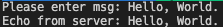

# 🌐 UDP Sockets
A connectionless transmission model with a minimum protocol mechanism. Unlike TCP, UDP (Use Datagram Protocol) have no handshaking/acknowledgements of data (No ACKs). Because of this, it's not guaranteed that any data is received by the end host. The up side, this avoids some delays due to it's simplicity.

### Program
A *C Language* based executable program that sends UDP commands/packets to a specified server host from a local client host.

## ⚙️ SETUP
### Makefile
- To *create* executable objects of client and server, run `make` within the **udp** directory.
  - Note: Compiler warning messages are disabled.
- To *remove/clean* objects created, run `make clean`.

### CLI Commands
The **client** executable file takes two command line arguments. The first is the IP address, and the second is the port number the server application is using. To find the IP address of the current server, try `hostname -i` (Linux). The **server** will use it's current IP, and only needs the port number to open.
  - Complile the *C*-program
      `gcc udp_client.c -o udp_client`  
      `gcc udp_server.c -o udp_server`  
      *OR* run [makefile](#makefile) commands (details in section above)

#### Connect to one of CUB's educational labs remote access servers:
SSH into Linux VM: `ssh <IDENTIKEY>@elra-##.cs.colorado.edu`, ## can be 01, 02, 03, or 04  
*Password* is same as IDENTIKEYs  
Find IP of server: `ip addr`  

##### Sent files from local to elra server
1. From client:
```shell
scp -r <local_folder_location> <IDENTIKEY>@elra-##.cs.colorado.edu:<folder location>
# Example:
scp -r ./UDP_Sockets/udp name@elra-02.cs.colorado.edu:./udp_sockets
```

#### Sending requests to server
  1. Create object executable files, listed under [CLI Commands](#cli-commands) above.
  2. Open port on server to connect incoming traffic to `./udp_server <port>`.
  3. Connect to the server with  `./udp_client <server ip> <port>`.
  4. Enter command when prompted on the client.
  5. *Note: this can be run locally, using different ports for the server and client.*  
      

## 📟 USE
#### UDP User (client) Commands
  1. `get <file_name>` - copies specified *file_name* **from** the server
  2. `put <file_name>` - copies specified *file_name* **to** the server
  3. `delete <file_name>` - delete specified *file_name* from the server
  4. `ls` - lists out all files in the current directory
  5. `exit` - exits out of client console
  6. Any command not listed above will loop back to available commands.
      <!-- - Client:: 
      - Server::  -->
